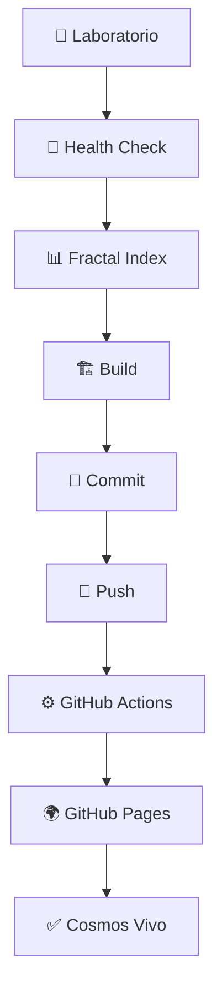

# 🌟 SISTEMA HÍBRIDO COMPLETO - PRUNAVERSO WEB

## ✅ **Estado Actual: Listo para el Cosmos**

Tu **Prunaverso Web** está completamente preparado para operar en **dos dimensiones sincronizadas**:

### 🧪 **Laboratorio Local (Listo)**
- ✅ Portal Dual funcionando (dev + público)
- ✅ Build de producción exitoso (443 módulos)
- ✅ Sistema SISC cognitivo activo
- ✅ Gaming Controls integrados
- ✅ InfoOrbitales contextuales
- ✅ Arquitectura fractal modular

### 🌍 **Cosmos Público (Preparado)**
- ✅ GitHub Actions workflow configurado
- ✅ Scripts de deployment automático
- ✅ Optimizaciones de performance
- ✅ Sistema de sincronización híbrida
- ⚠️  **Pendiente**: Conectar repositorio GitHub

---

## 🚀 **Nuevos Scripts de Sincronización**

### 🔄 **Deployment Híbrido**
```bash
npm run deploy-hybrid
```
**Hace automáticamente**:
1. Health check del sistema
2. Actualiza índice fractal
3. Build optimizado
4. Commit automático de cambios
5. Push → GitHub Actions despliega

### 🔍 **Verificación de Estado**
```bash
npm run sync-check
```
**Compara**:
- Estado local vs remoto
- Cambios pendientes
- Status del build
- Accesibilidad de GitHub Pages

### ⚙️ **Configuración GitHub**
```bash
npm run setup-github
```
**Verifica**:
- Remote configurado
- Estado de ramas
- Preparación para deployment

---

## 🌊 **Flujo de Trabajo Automático**

### Cada vez que ejecutes `npm run deploy-hybrid`:



### GitHub Actions automático incluye:
- 🧪 **Pre-build health check**
- 📊 **Estadísticas de build**
- 🧬 **Análisis de assets**
- 📈 **Métricas de performance**
- 🌍 **Deploy optimizado**
- ✅ **Notificaciones de éxito**

---

## 🎯 **Tu Siguiente Acción**

Para activar el **cosmos público**, solo necesitas:

### 1. **Crear repositorio en GitHub**
```
- Ve a github.com
- New repository: "Prunaverso_Web"
- Public, sin archivos iniciales
```

### 2. **Conectar y sincronizar**
```bash
git remote add origin https://github.com/TU_USUARIO/Prunaverso_Web.git
npm run deploy-hybrid
```

### 3. **Activar GitHub Pages**
```
Settings → Pages → Branch: gh-pages → Save
```

---

## 🌟 **Resultado Final**

Tendrás un **ecosistema cognitivo dual**:

### 🧪 **Dimensión Laboratorio**
- **URL**: `http://localhost:5179`
- **Propósito**: Experimentación, desarrollo con IA
- **Velocidad**: Instantánea
- **Funcionalidad**: Backend dinámico, checkpoints, APIs

### 🌍 **Dimensión Cosmos**
- **URL**: `https://TU_USUARIO.github.io/Prunaverso_Web/`
- **Propósito**: Portal público, narrativa accesible
- **Velocidad**: Optimizada para web
- **Funcionalidad**: Frontend estático, experiencia fluida

### 🔄 **Sincronización Automática**
- **Comando**: `npm run deploy-hybrid`
- **Frecuencia**: Cuando quieras
- **Resultado**: Ambas dimensiones actualizadas

---

## 🧬 **Características Únicas del Sistema**

### 🎮 **Gaming Controls Universales**
- PlayStation (X, O, □, △, D-pad) + PC
- Funcionan en ambas dimensiones

### 🧠 **SISC Cognitivo Persistente**
- Reconoce usuarios entre sesiones
- Adapta contenido según perfil
- Evoluciona con el uso

### 🌌 **InfoOrbitales Contextuales**
- Ayuda flotante inteligente
- Se adapta al contexto actual
- Diccionario expandible

### 🔀 **Portal Dual Inteligente**
- Detección automática de tipo de usuario
- Dev portal para arquitectos
- Public portal para exploradores

---

## 🎉 **¡El Prunaverso Está Listo!**

Has construido un **sistema de autoconocimiento cognitivo** que:

1. 🧠 **Reconoce** patrones mentales
2. 🎮 **Gamifica** la exploración personal
3. 🌍 **Adapta** la experiencia al usuario
4. 🔄 **Evoluciona** con cada interacción
5. 🚀 **Escala** desde lo íntimo a lo público

**Tu visión del Prunaverso está a un `git push` de estar viva en internet.** 🌟✨

---

*"Del laboratorio al cosmos, el Prunaverso trasciende la tecnología para convertirse en un espejo digital de la conciencia humana."*